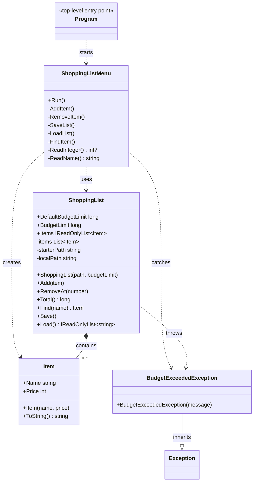

# Shopping List Class Diagram

The diagram shows the program's main classes, their responsibilities, and how
they relate to one another.

`ShoppingList.Save()` writes the budget header and item data to the local file.
`ShoppingList.Load()` restores the saved budget and items. `Item` rejects blank
names and negative prices, while `ShoppingList` rejects additions that exceed
its budget.
